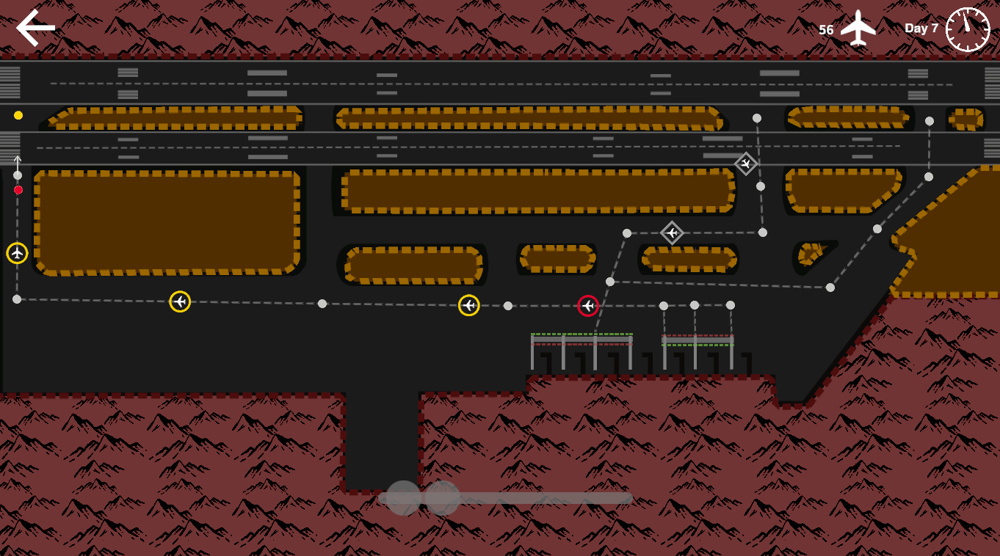

# Mini Ground Controller

A Mini Airways mod for ground control. In this proof-of-concept mod, you will need to control the ground movement of the aircraft. You can stop a moving aircraft by clicking it but not giving it any heading. To resume movement, do the same thing again.

This mod works great with the [GiveMeAnUpgrade](https://github.com/dogdie233/MiniAirwaysMods/tree/master/GiveMeAnUpgrade) mod.

Only use the included [map](https://github.com/ericpzh/MiniTower/blob/main/MiniTower.cm1).

# How to Install

- Switch the game to `mod_feat - Mod` test version on steam.
- Install [BepInEx](https://docs.bepinex.dev/articles/user_guide/installation/index.html) into the game
- Copy [MiniTower.dll](https://github.com/ericpzh/MiniTower/blob/main/bin/Debug/netstandard2.1/MiniTower.dll) into `<path_to_game>\Mini Airways Playtest\BepInEx\plugins`

***

# 迷你塔台

一个模拟地面管制的迷你空管Mod。您需要指挥飞机在地面移动。单击选中飞机但不给予其任何航向可以使飞机停下（或恢复移动）。

推荐同时使用[给我一个升级](https://github.com/dogdie233/MiniAirwaysMods/tree/master/GiveMeAnUpgrade) mod.

请使用mod自带的 [地图](https://github.com/ericpzh/MiniTower/blob/main/MiniTower.cm1).

# 如何安装

- 右键库中的Mini Airways Playtest，属性 - 测试版 - mod_feat, 更新。
- 下载安装 [BepInEx](https://docs.bepinex.dev/articles/user_guide/installation/index.html)。
- 复制 [MiniTower.dll](https://github.com/ericpzh/MiniTower/blob/main/bin/Debug/netstandard2.1/MiniTower.dll) 到 `<path_to_game>\Mini Airways Playtest\BepInEx\plugins`。
